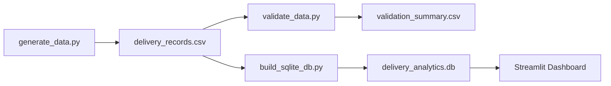

# Architecture

## Overview
This project uses a local-first analytics architecture:
- Synthetic data generation (Python)
- Data validation and quality reporting (Python + CSV summary)
- Analytical storage/modeling (SQLite)
- Interactive BI layer (Streamlit + Plotly)

## Flow
1. `scripts/generate_data.py` writes `data/processed/delivery_records.csv`
2. `scripts/validate_data.py` validates and writes `data/processed/validation_summary.csv`
3. `scripts/build_sqlite_db.py` loads CSV into SQLite and creates analytics views
4. `streamlit_app.py` reads SQLite/CSV and renders analytics pages

## Mermaid Diagram

